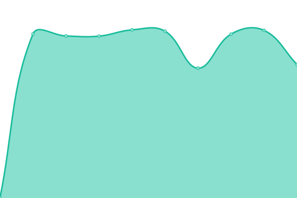
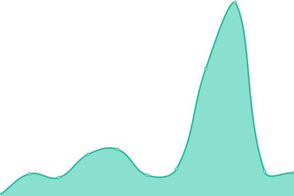

# [📈 Live Status](https://demo.upptime.js.org): <!--live status--> **🟧 Partial outage**

This repository contains the open-source uptime monitor and status page for [Upptime](https://upptime.js.org), powered by [Upptime](https://github.com/upptime/upptime).

With [Upptime](https://upptime.js.org), you can get your own unlimited and free uptime monitor and status page, powered entirely by a GitHub repository. We use [Issues](https://github.com/upptime/upptime/issues) as incident reports, [Actions](https://github.com/upptime/upptime/actions) as uptime monitors, and [Pages](https://demo.upptime.js.org) for the status page.

<!--start: status pages-->
<!-- This summary is generated by Upptime (https://github.com/upptime/upptime) -->
<!-- Do not edit this manually, your changes will be overwritten -->

| URL                                                                                   | Status  | History                                                                                           | Response Time                                                                  | Uptime                                                                                                                                                                                                                           |
| ------------------------------------------------------------------------------------- | ------- | ------------------------------------------------------------------------------------------------- | ------------------------------------------------------------------------------ | -------------------------------------------------------------------------------------------------------------------------------------------------------------------------------------------------------------------------------- |
| [Google](https://www.google.com)                                                      | 🟩 Up   | [google.yml](https://github.com/fmmaia/fmAtAllUptime/commits/master/history/google.yml)           |  135ms    |           |
| [Wikipedia](https://en.wikipedia.org)                                                 | 🟩 Up   | [wikipedia.yml](https://github.com/fmmaia/fmAtAllUptime/commits/master/history/wikipedia.yml)     |  183ms |     |
| [Site 1](https://fmath.duckdns.org)                                                   | 🟩 Up   | [site-1.yml](https://github.com/fmmaia/fmAtAllUptime/commits/master/history/site-1.yml)           |  756ms    |           |
| [Site 2](https://fmath.duckdns.org:10443/suitecrm/index.php?module=Home&action=index) | 🟩 Up   | [site-2.yml](https://github.com/fmmaia/fmAtAllUptime/commits/master/history/site-2.yml)           |  584ms    |            |
| Secret Site                                                                           | 🟥 Down | [secret-site.yml](https://github.com/fmmaia/fmAtAllUptime/commits/master/history/secret-site.yml) |  0ms |  |

<!--end: status pages-->

[**Visit our status website →**](https://demo.upptime.js.org)

## 📄 License

- Code: [MIT](./LICENSE) © [Upptime](https://upptime.js.org)
- Data in the `./history` directory: [Open Database License](https://opendatacommons.org/licenses/odbl/1-0/)
