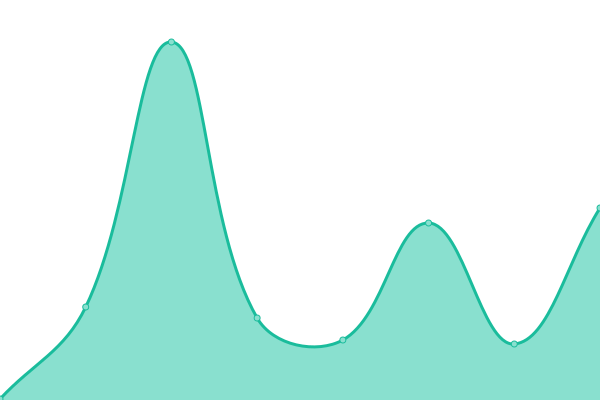
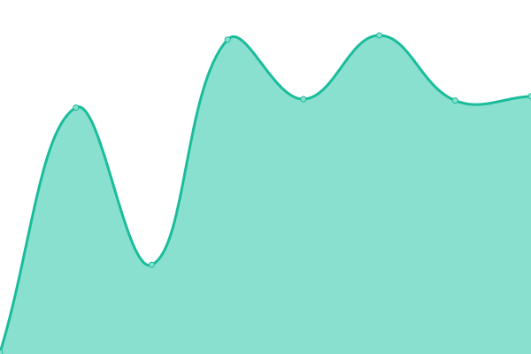
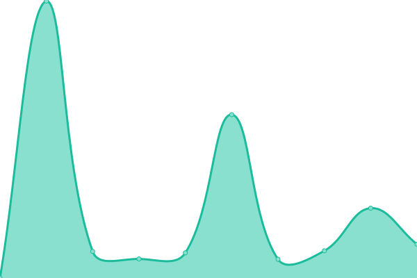

# [📈 Live Status](https://demo.upptime.js.org): <!--live status--> **🟩 All systems operational**

This repository contains the open-source uptime monitor and status page for [Upptime](https://upptime.js.org), powered by [Upptime](https://github.com/upptime/upptime).

With [Upptime](https://upptime.js.org), you can get your own unlimited and free uptime monitor and status page, powered entirely by a GitHub repository. We use [Issues](https://github.com/upptime/upptime/issues) as incident reports, [Actions](https://github.com/upptime/upptime/actions) as uptime monitors, and [Pages](https://demo.upptime.js.org) for the status page.

<!--start: status pages-->
<!-- This summary is generated by Upptime (https://github.com/upptime/upptime) -->
<!-- Do not edit this manually, your changes will be overwritten -->
<!-- prettier-ignore -->
| URL | Status | History | Response Time | Uptime |
| --- | ------ | ------- | ------------- | ------ |
|  [Google](https://www.google.com) | 🟩 Up | [google.yml](https://github.com/fmmaia/fmAtAllUptime/commits/HEAD/history/google.yml) | 

 85ms
     
 | 

<a href="https://fmmaia.github.io/fmAtAllUptime/history/google">100.00%</a>
    

|  [Wikipedia](https://en.wikipedia.org) | 🟩 Up | [wikipedia.yml](https://github.com/fmmaia/fmAtAllUptime/commits/HEAD/history/wikipedia.yml) | 

 190ms
     
 | 

<a href="https://fmmaia.github.io/fmAtAllUptime/history/wikipedia">100.00%</a>
    

|  Site Mail | 🟩 Up | [site-mail.yml](https://github.com/fmmaia/fmAtAllUptime/commits/HEAD/history/site-mail.yml) | 

 1427ms
     
 | 

<a href="https://fmmaia.github.io/fmAtAllUptime/history/site-mail">99.44%</a>
    

|  Site nxtc | 🟩 Up | [site-nxtc.yml](https://github.com/fmmaia/fmAtAllUptime/commits/HEAD/history/site-nxtc.yml) | 

 806ms
     
 | 

<a href="https://fmmaia.github.io/fmAtAllUptime/history/site-nxtc">98.03%</a>
    

|  Site nxtcATS | 🟩 Up | [site-nxtc-ats.yml](https://github.com/fmmaia/fmAtAllUptime/commits/HEAD/history/site-nxtc-ats.yml) | 

 603ms
     
 | 

<a href="https://fmmaia.github.io/fmAtAllUptime/history/site-nxtc-ats">98.04%</a>
    

|  Site suite | 🟩 Up | [site-suite.yml](https://github.com/fmmaia/fmAtAllUptime/commits/HEAD/history/site-suite.yml) | 

 764ms
     
 | 

<a href="https://fmmaia.github.io/fmAtAllUptime/history/site-suite">98.60%</a>
    

<!--end: status pages-->

[**Visit our status website →**](https://demo.upptime.js.org)

## 📄 License

- Code: [MIT](./LICENSE) © [Upptime](https://upptime.js.org)
- Data in the `./history` directory: [Open Database License](https://opendatacommons.org/licenses/odbl/1-0/)
