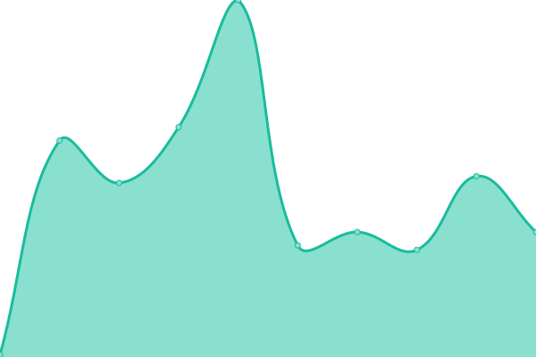
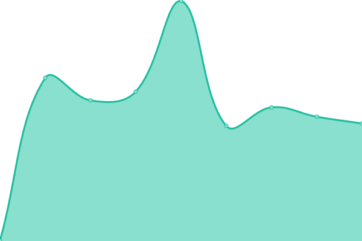

# [📈 Live Status](https://demo.upptime.js.org): <!--live status--> **🟧 Partial outage**

This repository contains the open-source uptime monitor and status page for [Upptime](https://upptime.js.org), powered by [Upptime](https://github.com/upptime/upptime).

With [Upptime](https://upptime.js.org), you can get your own unlimited and free uptime monitor and status page, powered entirely by a GitHub repository. We use [Issues](https://github.com/upptime/upptime/issues) as incident reports, [Actions](https://github.com/upptime/upptime/actions) as uptime monitors, and [Pages](https://demo.upptime.js.org) for the status page.

<!--start: status pages-->
<!-- This summary is generated by Upptime (https://github.com/upptime/upptime) -->
<!-- Do not edit this manually, your changes will be overwritten -->

| URL                                   | Status  | History                                                                                               | Response Time                                                                    | Uptime                                                                                                                                                                                                                              |
| ------------------------------------- | ------- | ----------------------------------------------------------------------------------------------------- | -------------------------------------------------------------------------------- | ----------------------------------------------------------------------------------------------------------------------------------------------------------------------------------------------------------------------------------- |
| [Google](https://www.google.com)      | 🟩 Up   | [google.yml](https://github.com/fmmaia/fmAtAllUptime/commits/master/history/google.yml)               |  116ms      |              |
| [Wikipedia](https://en.wikipedia.org) | 🟩 Up   | [wikipedia.yml](https://github.com/fmmaia/fmAtAllUptime/commits/master/history/wikipedia.yml)         |  187ms   |        |
| Site Mail                             | 🟩 Up   | [site-mail.yml](https://github.com/fmmaia/fmAtAllUptime/commits/master/history/site-mail.yml)         |  3569ms  |         |
| Site nxtc                             | 🟩 Up   | [site-nxtc.yml](https://github.com/fmmaia/fmAtAllUptime/commits/master/history/site-nxtc.yml)         |  708ms   |         |
| Site nxtcATS                          | 🟥 Down | [site-nxtc-ats.yml](https://github.com/fmmaia/fmAtAllUptime/commits/master/history/site-nxtc-ats.yml) |  0ms |  |
| Site suite                            | 🟩 Up   | [site-suite.yml](https://github.com/fmmaia/fmAtAllUptime/commits/master/history/site-suite.yml)       |  1865ms |       |

<!--end: status pages-->

[**Visit our status website →**](https://demo.upptime.js.org)

## 📄 License

- Code: [MIT](./LICENSE) © [Upptime](https://upptime.js.org)
- Data in the `./history` directory: [Open Database License](https://opendatacommons.org/licenses/odbl/1-0/)
